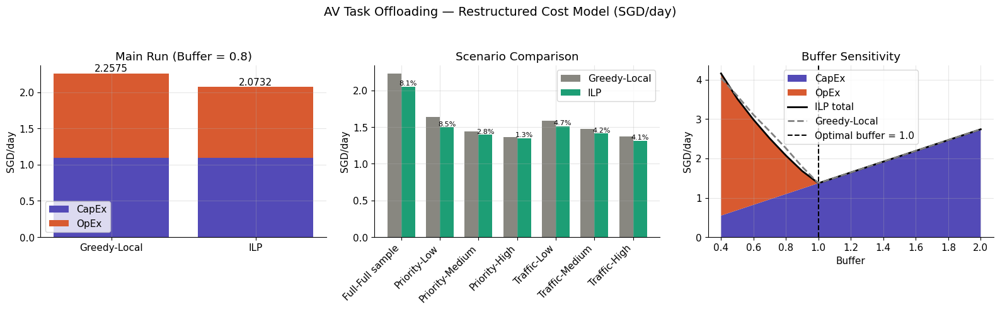
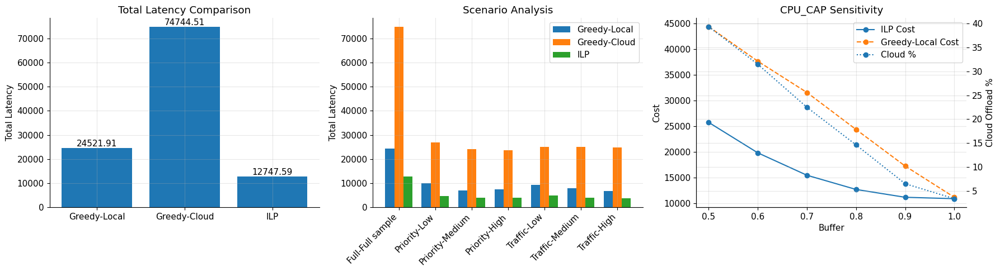

# Autonomous Vehicle Task Offloading: A Prescriptive Analytics Approach



**8.2% lower daily cost than the industry-standard heuristic, using the same hardware**
Built with Python · Gurobi · pandas · NumPy · matplotlib

📄 [Read the full report (PDF)](AV_Task_Offloading_Report.pdf)

---

## 📌 Key Results

- **The integer linear program cut daily processing cost from SGD 2.2575 to SGD 2.0732 (8.2%)** versus the standard Greedy-Local rule, without buying any extra hardware. The saving comes entirely from smarter offloading decisions, not a bigger budget.
- **In the latency model, the ILP achieved a total latency of 12,748 versus 24,522 for Greedy-Local and 74,745 for Greedy-Cloud**, roughly halving the best heuristic while still respecting every safety constraint.
- **The optimiser beat the heuristic in all seven tested scenarios**, with savings of 1.3% to 8.5% across priority and traffic shifts, showing the advantage is robust to changing workload composition rather than overfitted to one case.
- **At fleet scale this compounds to roughly SGD 675,000 over ten years for 1,000 vehicles**, achieved through software logic alone with no change to the vehicle's physical architecture.

---

## 🧠 Why This Project

I am working toward a career in quantitative finance, specifically the cluster of roles around investment risk, portfolio analytics and derivatives quant and strats work. The skill that ties that cluster together is constrained optimisation: deciding how to allocate a scarce resource to minimise a cost or maximise a risk-adjusted return, subject to hard limits you are not allowed to break. This project is a deliberate exercise in exactly that machinery, just dressed in an autonomous-vehicle problem rather than a financial one.

The structure is identical to the problems I want to solve on a desk. Here the objective is to minimise total processing cost; the constraints are a safety rule, a compute-capacity limit and a latency service-level agreement; the solver finds the globally optimal task allocation. Swap the words and it becomes a hedging problem: minimise hedge cost subject to exposure limits on delta, gamma and vega. That is precisely the formulation of my planned flagship project, a Multi-Greek Hedge Optimizer, and building this one first let me get fluent with the modelling pattern (objective, decision variables, constraints, solver, sensitivity analysis) on a problem where I could clearly see and validate the answer before applying it to money.

It also reflects how I think about markets. I am drawn to cause-and-effect, to how one variable moves another and where the binding constraint actually sits. The buffer sensitivity analysis here is a small version of that: it traces how spending more on onboard hardware (capex) trades off against cloud spend (opex) and pins down the point where total cost is minimised. That capex-versus-opex, risk-versus-cost reasoning is the same logic that runs through real portfolio construction and hedging decisions.

**How it links to my other projects.** This is the optimisation foundation of my portfolio. My [Black-Litterman Sector Rotation](https://github.com/l3wisdang/black-litterman-sector-rotation) project applies the same optimise-under-constraints logic directly to asset allocation (maximise Sharpe subject to weight caps), while my [Monte Carlo Risk of Ruin](https://github.com/l3wisdang/monte-carlo-risk-of-ruin) project covers the simulation and risk-quantification side. Together they build toward the Multi-Greek Hedge Optimizer, which combines all three threads: pricing and simulation, risk measurement, and cost-minimising optimisation under constraints.

---

## 📦 Technologies

| Tool | Purpose |
|---|---|
| Python | Core language |
| Gurobi (gurobipy) | Integer linear programming solver |
| pandas / NumPy | Data preparation and the VEINS telemetry dataset |
| matplotlib | Sensitivity charts and result visualisation |

---

## ⚙️ Method in Brief

The data is a vehicular simulation dataset (VEINS OMNeT++), filtered to a single vehicle and stratified-sampled down to 800 representative tasks as a one-day workload. Each task carries a size, available local CPU, network latency, signal strength, priority and weather condition. A binary `force_local` safety flag is set whenever the signal is weak or weather is severe, which applied to about 11% of tasks.

I built two integer linear programs, both solved with Gurobi in under a second. The first minimises total latency by choosing, for each task, local or cloud execution subject to a safety constraint and a local CPU capacity limit. The second is the headline model: it minimises real money cost, splitting hardware capital expense (a one-time cost amortised per day) from cloud operating expense (pay-per-task), and adds a latency service-level-agreement constraint with a small violation budget. Both are benchmarked against Greedy-Local and Greedy-Cloud heuristics, and a buffer sensitivity analysis traces the capex-versus-opex trade-off as onboard hardware power changes.

The full formulation, assumptions, scenario tables, feasibility analysis and limitations are in the [report](AV_Task_Offloading_Report.pdf).



---

## 📚 What I Learned

**Global optimisation beats local rules precisely when resources are scarce.** The gap between the ILP and the greedy baseline was widest at low CPU buffers, the exact high-load conditions a real vehicle faces most often. When capacity was generous the two converged, because there is little to optimise. The model adds the most value where it matters most.

**Splitting capex from opex changes the whole problem.** Once onboard hardware is treated as a sunk one-time cost with near-zero marginal cost, the solver is really just minimising cloud spend under constraints. Framing the cost structure correctly was as important as the optimisation itself.

**A constraint is only as good as the data that exercises it.** The safety rule was correctly formulated but triggered almost entirely by weak signal; severe weather never appeared in the sample. It taught me to be honest about what a model has and has not actually been stress-tested against, which is now a section in the report rather than something glossed over.

---

## 💬 How Can It Be Improved?

- **Rolling-horizon scheduling.** The current model is a static single-period batch over 800 tasks. Real tasks arrive sequentially, so a production version should re-optimise over short look-ahead windows.
- **Priority-weighted objective.** The dataset has a task priority field that does not yet enter the objective. Weighting high-priority tasks would let the optimiser explicitly protect safety-critical work.
- **Compound stress testing.** Validate the safety constraint under simultaneous poor signal, bad weather and low battery, the worst-case conditions currently under-represented in the data.
- **Broader sensitivity scope.** Vary network latency, battery thresholds and signal cutoffs, not just the CPU buffer, to build a fuller robustness profile.

---

## 🔌 Running the Project

```bash
pip install gurobipy pandas numpy matplotlib
jupyter notebook av_task_offloading_ilp.ipynb
```

Gurobi requires a licence; a free academic licence covers a problem of this size. The notebook runs end to end: data prep, both ILP formulations, the heuristic baselines, scenario comparison and the sensitivity charts.

---

## 🙏 Acknowledgments

- Group project for BC2411 Prescriptive Analytics, Nanyang Technological University. Team members: Lee Pei Wen, Pahwa Ronak, Lewis Dang, Sheng Xiaxi.
- Qayyum, T. (2025). [Vehicular Simulation Dataset (VEINS OMNeT++)](https://www.kaggle.com/datasets/ranatariq09/vehicular-simulation-dataset-veins-omnet). Kaggle.
- Viktor, P. and Kiss, G. (2026). [Sensors in Self-Driving Vehicles: A Detailed Literature Review and New Trends](https://doi.org/10.3390/s26072153). Sensors, 26(7), 2153.
- Optimisation solved with [Gurobi](https://www.gurobi.com/).
